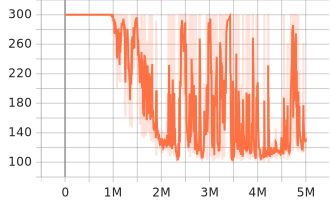
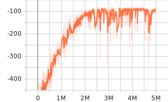

# 《机器人学》大作业 3

徐恺阳 523030910085

## 引言 

大作业 3 包含以下内容：

1. 使用仿真环境 `pybullet` 完善抓取方块任务的仿真环境；
2. 使用强化学习算法（DQN），完成抓取方块任务的操作策略的训练和优化；
3. 机械臂夹爪距离目标物体的距离小于阈值（0.005m），则视为任务成功。

## 任务一

### 任务描述

在 `panda_env.py` 中，完善仿真环境中的奖励函数。

提示：可以考虑以下几个方向
- 靠近奖励：目标方块和夹爪的距离越近，奖励越大；
- 到达奖励：当目标方块和夹爪的距离小于目标阈值时，给予固定奖励。

### 任务实现

`_get_reward` 函数中：

1. **靠近奖励**
    - 目标方块和夹爪的距离越近，奖励越大；
    - 引导机械臂靠近目标物体。
    ```py
    r_reaching = -10 * ee_to_object_dist
    ```

2. **到达奖励**
    - 当目标方块和夹爪的距离小于目标阈值时，给予固定奖励；
    - 作为一个稀疏的成功信号，强化机械臂最终到达目标物体的行为。
    ```py
    if ee_to_object_dist < 0.012:
        r_arrival = 10
    ```

3. **总奖励**
    ```py
    reward = r_reaching + r_arrival
    ```

## 任务二

### 任务描述

定义动作空间和观测空间。

### 任务实现

1. **动作空间**
    - 离散空间：7 个离散动作
       - 动作 1：夹爪沿 x 轴负方向移动 0.01m；
       - 动作 2：夹爪沿 x 轴正方向移动 0.01m；
       - 动作 3：夹爪沿 y 轴负方向移动 0.01m；
       - 动作 4：夹爪沿 y 轴正方向移动 0.01m；
       - 动作 5：夹爪沿 z 轴负方向移动 0.01m；
       - 动作 6：夹爪沿 z 轴正方向移动 0.01m；
       - 动作 7：保持静止。
    ```py
    self.action_space = spaces.Discrete(7)
    ```

2. **观测空间**
    - 连续空间
       - 机械臂关节角度 `qpos`：9 维（7 维机械臂关节 + 2 维夹爪）；
       - 机械臂夹爪位姿 `eepose`：7 维（3 维位置 + 4 维四元数）；
       - 机械臂夹爪到目标物体的相对位置 `ee_to_object_pos`：3 维；
       - 目标物体位姿 `object_pose`：7 维（3 维位置 + 4 维四元数）。
    ```py
    self.observation_space = spaces.Dict({
        "qpos": spaces.Box(low=-np.inf, high=np.inf, shape=(9,), dtype=np.float32),
        "eepose": spaces.Box(low=-np.inf, high=np.inf, shape=(7,), dtype=np.float32),
        "ee_to_object_pos": spaces.Box(low=-np.inf, high=np.inf, shape=(3,), dtype=np.float32),
        "object_pose": spaces.Box(low=-np.inf, high=np.inf, shape=(7,), dtype=np.float32),
    })
    ```

3. **获取观测**
    - `qpos` 和 `eepose` 通过 `Panda` 类获取；
    - `object_pose` 通过 `pybullet` 获取；
    - `ee_to_object_pos` 等于末端位置减去目标物体位置。
    ```py
    object_pos, object_orn = p.getBasePositionAndOrientation(self.object)
    Observation["object_pose"] = np.array(object_pos + object_orn)
    Observation["ee_to_object_pos"] = Observation["eepose"][:3] - Observation["object_pose"][:3]
    ```

## 任务三

### 任务描述

在任务二的基础上完善 `step` 函数，根据输入动作下发机械臂控制指令。

利用 `test_gym.py` 验证动作的可行性。

### 任务实现

1.  **动作映射**
    - 将输入的离散动作（0-6）转换为机械臂任务空间的动作； 
    - 0, 1, 2, 3, 4, 5, 6 分别对应 -dx, dx, -dy, dy, -dz, dz, static。
    ```py
    dx = [-d, d, 0, 0, 0, 0, 0][action]
    dy = [0, 0, -d, d, 0, 0, 0][action]
    dz = [0, 0, 0, 0, -d, d, 0][action]
    self.realAction = np.array([dx, dy, dz, 0.04])
    ``` 

2.  **执行动作**
    - 调用 `self._panda.applyAction(self.realAction)` 函数；
    - 底层 `Panda` 类通过 IK 解算目标关节角，并利用 PD 控制器控制电机。

3.  **仿真步进**
    - `pybullet` 执行物理步进 `p.stepSimulation()`。

4. **状态更新**
   - 返回当前观测值、奖励、是否终止、是否截断和额外信息。
   ```py
    return self._observation, reward, terminated, truncated, info
   ``` 

## 任务四

### 任务描述

基于 DQN 算法，完成操作策略的训练，记录训练曲线，并测试效果。

### 任务实现


DQN 算法的核心流程如下：

1. **初始化**
   - 构建向量化环境 `SyncVectorEnv`；
   - 初始化 Q 网络与目标网络；
   - 创建经验回放池 `ReplayBuffer`。
2.  **数据收集**
    - 使用 $\epsilon$-greedy 策略选择动作；
    - 与环境交互并将 `(s, a, r, s', done)` 存入经验回放池。
3.  **网络更新**
    - 从经验回放池随机采样 batch 数据；
    - 计算 TD 目标：$y = r + \gamma \max_{a'} Q_{target}(s', a')$；
    - 计算 Loss：$L = MSE(y, Q_{pred}(s, a))$；
    - 反向传播更新 Q 网络参数。
4.  **目标同步**
    - 定期将 Q 网络参数同步到目标网络。

训练参数如下：
- `buffer_size=10000`；
- `batch_size=128`；
- `gamma=0.99`；
- `lr=2.5e-4`；
- `total_timesteps=5_000_000`。

### 结果展示

训练曲线如图 1 和图 2 所示。

<div style="display: flex; justify-content: space-between;">
  <div style="text-align: center; width: 48%;">
    
    <p>图 1 回合长度</p>
  </div>
  <div style="text-align: center; width: 48%;">
    
    <p>图 2 回合回报</p>
  </div>
</div>

可以看出，随着训练的进行，
1. 回合长度逐渐降低至 100 左右；
    - 说明机械臂可以很好地完成任务，使得 termination 的判断为 true，回合提前终止。
2. 回合回报逐渐上升至 -100 左右；
    - 说明机械臂在每个回合内获得的累积折扣奖励很多，回报很大。

测试 20 次策略效果，成功率为 **100%**，视频见 `results\record\20251121_144421.mp4`。

### 改进方向

1. 目标物体重置位置固定，且在逆运动学可解处；
   - 尝试随机化重置目标物体的位置。
2. 以目标物体的全局位置作为观测，仅在仿真中可行，在真机上是不可行的；
   - 尝试以目标物体在机械臂坐标系下的位置作为观测，或者引入外部摄像头。
3. 动作空间离散，需要求解逆运动学，耗时大，精度差，且无法完成复杂任务；
   - 尝试使用连续运动空间，将 DQN 更换为 SAC、PPO 等强化学习算法。