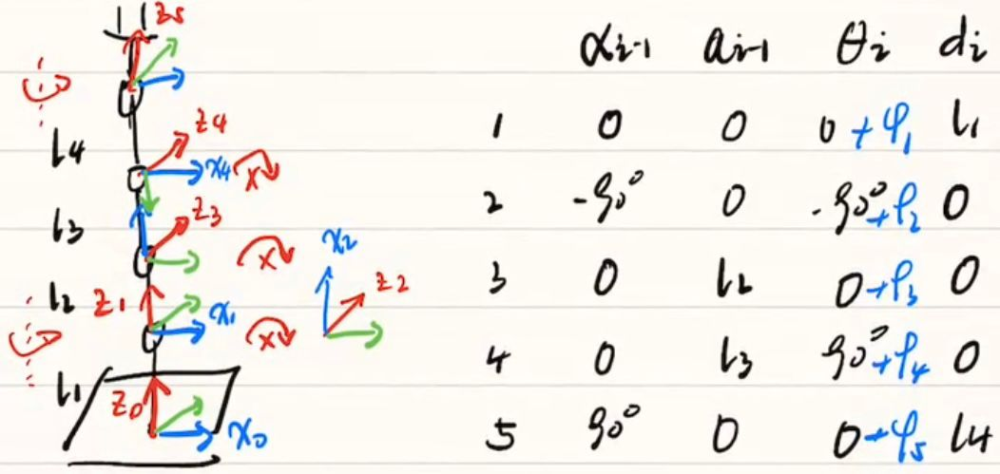
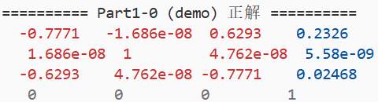
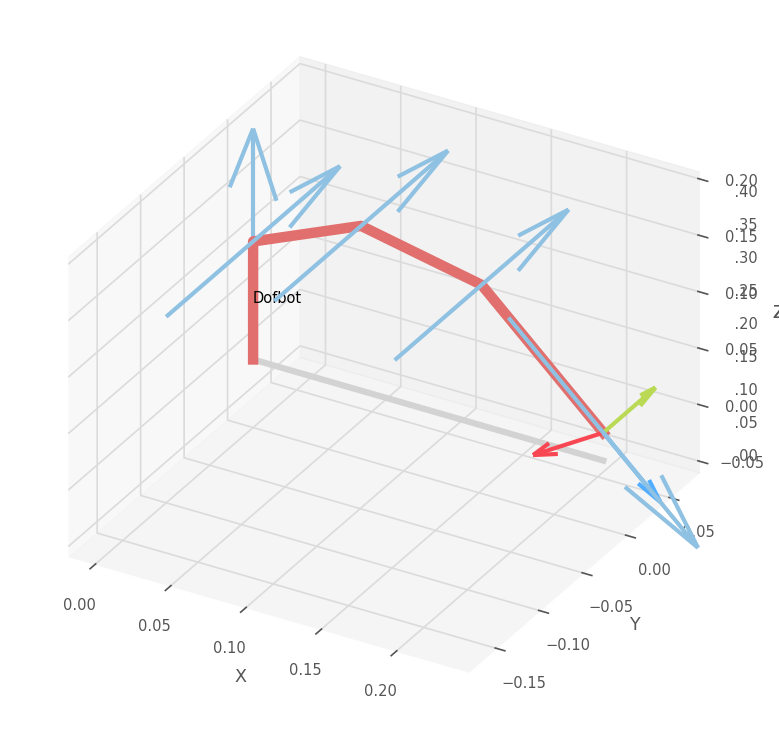
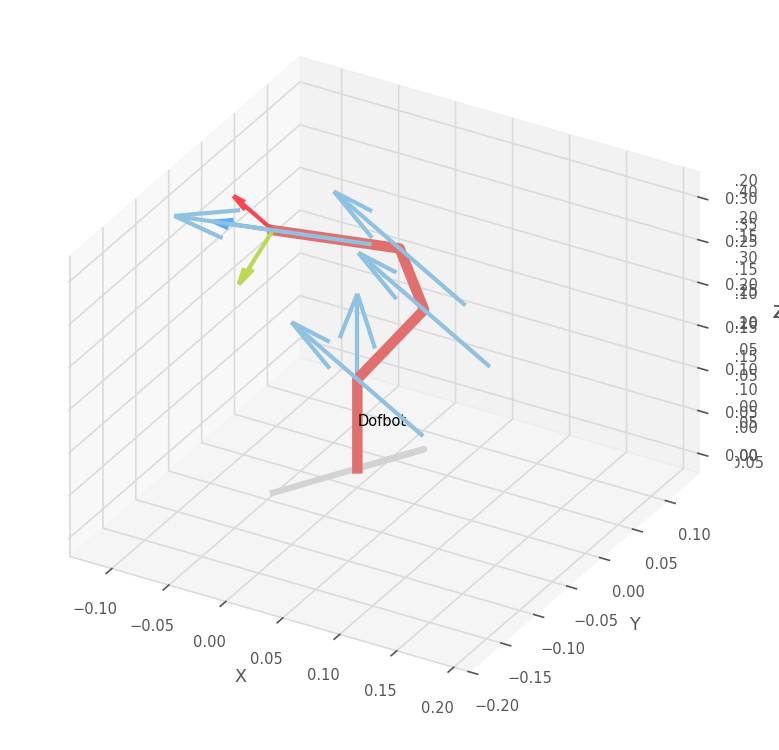
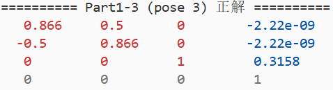
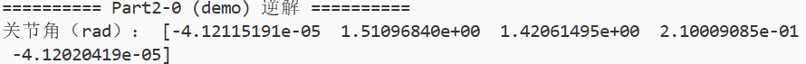
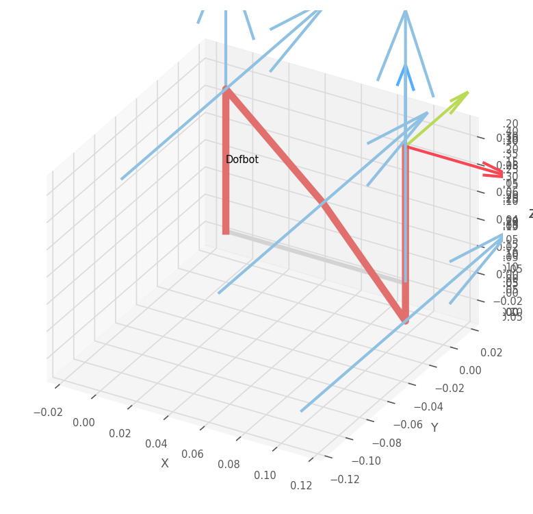
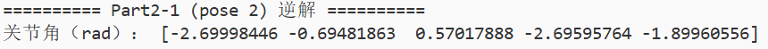
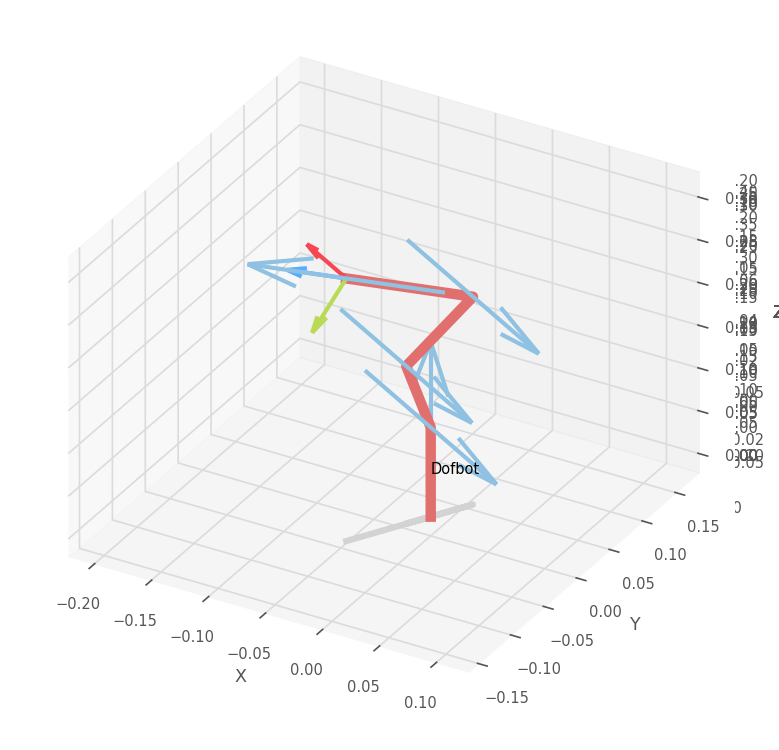
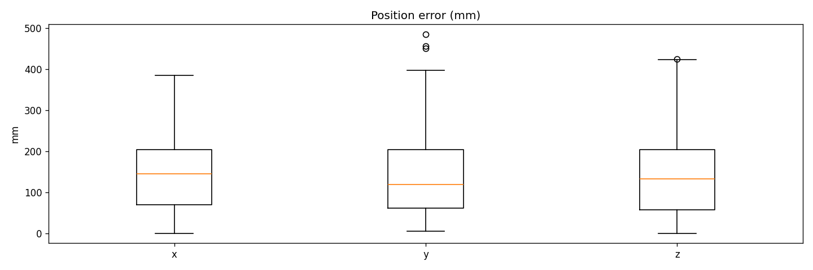

# 《机器人学》大作业 1

徐恺阳 523030910085

## 引言

大作业 1 包含以下内容：

1.  基于 `RobotToolboxPython` 工具完成 Dofbot 构型机械臂的建模、正运动学求解、逆运动学求解与工作空间的绘制；

2.  在 `PyBullet` 中，采集 Dofbot 机械臂末端位姿与关节角数据；

3.  训练神经网络模型，实现对机械臂正逆运动学的求解，并评估训练得到模型的精度；

4.  在 `PyBullet` 中，控制 Dofbot 机械臂完成物块抓取放置任务。

## 任务零：机械臂 DH 参数建模

### 任务描述

根据图 1 计算 Dofbot 机械臂的 DH 参数表，并使用 `RobotToolboxPython` 仿真正运动学，进行零位验证。


图 1 Dofbot 机械臂结构示意图



图 2 DH 参数表

### 任务实现

建立如图 2 所示的 坐标系，得出 DH 参数表，对 Dofbot 进行 DH 参数建模。

```
dofbot = rtb.DHRobot(
    [
        rtb.RevoluteMDH(a=0, alpha=0, d=l1, offset=0),
        rtb.RevoluteMDH(a=0, alpha=-pi/2, d=0, offset=-pi/2),
        rtb.RevoluteMDH(a=l2, alpha=0, d=0, offset=0),
        rtb.RevoluteMDH(a=l3, alpha=0, d=0, offset=pi/2),
        rtb.RevoluteMDH(a=0, alpha=pi/2, d=l4, offset=0)
    ],
    name="Dofbot"
)
```

### 结果展示

将全部关节置零，得到如图 3 所示的零位示意图。


图 3 零位示意图

## 任务一：正运动学求解

### 任务描述

给出 Dofbot 机械臂在特定关节角度下的正运动学解，并附上 `RobotToolboxPython` 给出的运动学姿态仿真。

### 任务实现

利用 `DHRobot` 类中的 `fkine` 和 `plot` 函数**解正运动学**，并实现运动学姿态仿真。

```
q_demo = [0., pi/3, pi/4, pi/5, 0.]
T_demo = dofbot.fkine(q_demo)
print(T_demo)
dofbot.plot(q=q_demo, block=True)
```

*   `q_demo` 是关节角度的输入列表，包含了机械臂五个关节的角度；

*   `dofbot.fkine(q_demo)` 是正运动学函数，返回一个变换矩阵，包含末端执行器的**位置**和**姿态**；

*   `dofbot.plot(q=q_demo, block=True)` 可视化机械臂在给定关节角度下的姿态。

### 结果展示










图 4 正运动学解


图 5 运动学姿态仿真

## 任务二：逆运动学求解

### 任务描述

给出 Dofbot 机械臂夹爪末端在以下笛卡尔空间姿态下的逆运动学解，并在报告中附上 `RobotToolboxPython` 给出的运动学姿态仿真。

### 任务实现

利用 `DHRobot` 类中的 `ik_LM` 和 `plot` 函数**解逆运动学**，并实现运动学姿态仿真。

```
T_des_demo = np.array([
    [-1., 0., 0., 0.1],
    [ 0., 1., 0., 0. ],
    [ 0., 0.,-1.,-0.1],
    [ 0., 0., 0., 1. ]
])
q_ik_demo = dofbot.ik_LM(T_des_demo)[0]   # 取返回元组第 0 个元素
print("关节角（rad）：", np.array(q_ik_demo))
dofbot.plot(q=q_ik_demo, block=True)
```

*   `T_des_demo` 是齐次变换矩阵，包含末端执行器的**位置**和**姿态**；

*   `dofbot.ik_LM(T_des_demo)[0]` 使用 *Levenberg\_Marquardt(LM)* 算法求解逆运动学。该函数返回一个元组，第一个元素是关节角度的解。

### 结果展示









图 6 逆运动学解



图 7 运动学姿态仿真

## 任务三：工作空间绘制

### 任务描述

按照关节空间针对每个关节进行采样，绘制机械臂工作空间。 Dofbot 关节角度限位：

*   J1: \[-180°, 180°]
*   J2: \[0°, 180°]
*   J3: \[0°, 180°]
*   J4: \[0°, 180°]
*   J5: \[0°, 180°]

### 任务实现

```
num_samples = 3000

j1_min, j1_max = -np.pi, np.pi # J1
j_min, j_max = 0.0, np.pi # J2~J5

q1 = np.random.uniform(j1_min, j1_max, num_samples)
q2 = np.random.uniform(j_min, j_max, num_samples)
q3 = np.random.uniform(j_min, j_max, num_samples)
q4 = np.random.uniform(j_min, j_max, num_samples)
q5 = np.random.uniform(j_min, j_max, num_samples)
q_samples = np.vstack((q1, q2, q3, q4, q5)).T # 形状: (N, 5)

points = np.zeros((num_samples, 3), dtype=float)
for i in range(num_samples):
    T = dofbot.fkine(q_samples[i])  # SE3
    points[i] = T.t.reshape(3)
```

*   `np.random.uniform` 在每个关节的上下限范围内生成 `num_samples` 个随机角度；

*   通过 `fkine` 函数求解正运动学，得到末端执行器的**位置**；

*   按 Z 高度着色绘制 `num_samples` 个工作点，并添加加颜色条。

### 结果展示


图 8 Dofbot 工作空间

从绘制结果可以看出，工作空间呈现出椭球状，且工作点出现在椭球中心以及椭球下方的数量居多。

## 任务四：数据采集与工作空间可视化

### 任务描述

在仿真环境中自行采集数据集，基于采集的数据集可视化工作空间。

### 任务实现

利用 `collect_dofbot_dataset` 函数进行仿真环境中的**数据采集**。

```
collect_dofbot_dataset(num_envs, num_samples, show_gui)
```

*   `num_envs` 是并行环境数，默认为 2；

*   `num_samples` 是总样本数，建议 10k 以上；

*   `show_gui` 是否可视化数据采集过程。

详细步骤如下：

1.  启动并行 worker

    *   计算 `samples_per_worker`，并为每个 worker 指定写入分片；

    *   并行调用 `worker(rank, samples_per_worker, flush_every, run_tag)`。

2.  主进程流式合并与统计

    *   遍历每个分片文件，计算全局 `mins` 和 `maxs`；

    *   合并所有分片为 `raw_csv`，按分片顺序逐块复制内容；

    *   把全局 min/max 写到 `stats_json`。

3.  生成归一化文件 `norm_csv`

    *   打开 `raw_csv`，逐行读取原始 24 维向量并拆分为 `q_raw`，`xyz`，`quat`，`euler`，`dir_vec`；

    *   归一化：

        *   `q_raw`：sin/cos 拼接 `sc_joint = [sin(q1),cos(q1),...,sin(q5),cos(q5)]`；

        *   `xyz`：MinMax 到 \[-1,1]；

        *   `quat`：保留原值；

        *   `euler`：`[sin(roll),cos(roll),...,sin(yaw),cos(yaw)]`

        *   `dir_vec`：线性缩放到 \[-1,1]

    *   组合并写入 `norm_csv`：`[sc_joint, xyz_n, quat, sc_euler, dir_n]`。

4.  返回

    *   返回三个路径 `raw_csv`，`norm_csv`，`stats_json`。

利用 `visualize_workspace` 函数进行**工作空间的可视化**，颜色按 Z 高度映射。

```
visualize_workspace(raw_csv)
```

*   `raw_csv` 是原始 CSV 文件。

详细步骤如下：

1.  读取 `raw_csv`，并提取位置列

    *   读入所有行，并提取第 6\~8 列，即 `xyz = data[:, 5:8]`。

2.  绘制 3D 散点图，并添加颜色条

### 结果展示


图 9 Dofbot 工作空间

从绘制结果可以看出，工作空间呈现出椭球状，且没有空洞，呈高度对称。

## 任务五：模型训练

### 任务描述

选择合适的神经网络结构，设置训练参数，基于采集/已有的数据集训练得到正逆运动学模型。

### 任务实现

利用 `train_dofbot_model` 函数选择神经网络结构，设置训练参数，训练**正逆运动学模型**。

```
train_dofbot_model(
        data_path, model_type, mode, in_cols, out_cols,
        epochs, lr, min_lr, hidden_layers
)
```

*   `data_path` 是训练数据的路径；

*   `model_type` 是网络模型；

*   `mode` 是训练类型；

*   `in_cols` 和 `out_cols` 是网络输入输出的数据和维度；

*   `epochs` `lr` 和 `hidden_layers` 是训练超参数。

具体步骤如下：

1.  数据准备

    *   使用已有的数据集 `dofbot_fk_120000_norm.csv`，列顺序为：

        *   关节角 sin/cos（10 维）
        *   位置 xyz（3 维）
        *   四元数 abcd（4 维）
        *   欧拉角 sin/cos（6 维）
        *   方向向量归一化（9 维）

    *   对训练/测试数据做 80/20 划分。

2.  模型构造

    *   使用 `FlexibleMLP`，隐藏层选择 `[256,256,128]`，其余均为默认配置。

3.  损失函数

    *   记网络预测为$y_{\mathrm{pred}}$，真实标签为$y_{\mathrm{true}}$，输出位置为$p\in\mathbb{R}^3$，输出姿态为$r\in\mathbb{R}^9$。

    *   FK 第一种损失函数：

        *   位置误差  $L_{\mathrm{pos}}$


        $$
        L_{\mathrm{pos}} = \lVert p_{\mathrm{pred}} - p_{\mathrm{true}}\rVert_2^2
        $$


        *   姿态误差  $L_{\mathrm{ori}}$


        $$
        L_{\mathrm{ori}} = \lVert r_{\mathrm{pred}} - r_{\mathrm{true}}\rVert_2^2 
        $$


        *   加权损失  $L_{\mathrm{total}}$


        $$
        L_{\mathrm{total}} = w_{\mathrm{pos}}L_{\mathrm{pos}} + w_{\mathrm{ori}}L_{\mathrm{ori}}
        $$

    *   FK 第二种损失函数：

        *   整体 MSE 误差  $L_{\mathrm{mse}}$


        $$
        L_{\mathrm{mse}} = \frac{1}{N}\sum_{i=1}^N \lVert y_{\mathrm{pred}}^{(i)} - y_{\mathrm{true}}^{(i)}\rVert_2^2
        $$

    *   IK考虑基于已训练的FK模型监督训练：当训练 IK 网络$f_{\mathrm{ik}}(x)\mapsto q_{\mathrm{pred}}$且使用冻结的$FK_{\mathrm{ref}}$将关节映射到末端位姿。


    $$
    q_{\mathrm{pred}} = f_{\mathrm{ik}}(x), \quad y_{\mathrm{fk}} = FK_{\mathrm{ref}}(q_{\mathrm{pred}}) 
    $$


    *   IK 第一种损失函数：

        *   加权损失  $L_{\mathrm{total}}$


        $$
        L_{\mathrm{total}} = w_{\mathrm{pos}}\lVert p(y_{\mathrm{fk}}) - p_{\mathrm{true}}\rVert_2^2 + w_{\mathrm{ori}}\lVert r(y_{\mathrm{fk}}) - r_{\mathrm{true}}\rVert_2^2
        $$

    *   IK 第二种损失函数：

        *   整体 MSE 误差  $L_{\mathrm{mse}}$


        $$
        L_{\mathrm{mse}} = \frac{1}{N}\sum_{i=1}^N \lVert y_{\mathrm{fk}}^{(i)} - y_{\mathrm{true}}^{(i)}\rVert_2^2
        $$

4.  训练超参与调度

    *   优化器：`Adam`，weight\_decay=1e-4；

    *   学习率与调度：初始 lr=1e-3，使用 `CosineAnnealingLR` 退火到 min\_lr=1e-5；

    *   训练轮次：FK/IK 均为 500 epoches；

    *   提前停止：若验证集在 50 个 epoches 内不再提升则提前停止。

### 结果展示

对于 FK 和 IK 网络训练，均使用第二种损失函数，即整体 MSE 误差 $L_{\mathrm{mse}}$。 我设计了一个**对比试验**，探究 **IK 网络的输入数据和维度对网络精确性的影响**。

1.  FK 网络的输入选取 `['q1_sin', 'q1_cos', 'q2_sin', 'q2_cos', 'q3_sin', 'q3_cos', 'q4_sin', 'q4_cos', 'q5_sin', 'q5_cos']`，IK 网路的输入选取`['x', 'y', 'z', 'nx', 'ny', 'nz', 'ox', 'oy', 'oz', 'ax', 'ay', 'az']`，即 12 维的齐次变换矩阵$T$；
2.  FK 网络的输入选取 `['q1_sin', 'q1_cos', 'q2_sin', 'q2_cos', 'q3_sin', 'q3_cos', 'q4_sin', 'q4_cos', 'q5_sin', 'q5_cos']`，IK 网路的输入选取`['x', 'y', 'z', 'roll_sin', 'roll_cos', 'pitch_sin', 'pitch_cos', 'yaw_sin', 'yaw_cos']`，即 9 维的 xyz+rpy；
3.  FK 网络的输入选取 `['q1_sin', 'q1_cos', 'q2_sin', 'q2_cos', 'q3_sin', 'q3_cos', 'q4_sin', 'q4_cos', 'q5_sin', 'q5_cos']`，IK 网路的输入选取`['x', 'y', 'z', 'a', 'b', 'c', 'd']`，即 7 维的 xyz+abcd。

可以看出，

1.  三种 IK 输入下训练曲线单调下降并趋于稳定，唯有输入为 12 维的齐次变换矩阵  $T$  时有些许波动；

2.  IK 网络输入为 9 维的 xyz+rpy 时的 FK 训练曲线收敛最快；

3.  IK 网络输入为 7 维的 xyz+abcd 时的 IK 训练曲线收敛最快。

## 任务六：模型验证

### 任务描述

调用训练得到的正逆运动学模型验证其预测结果，以从仿真环境中读取到的关节角度（或末端位姿）为真值，计算误差并分析原因。

### 任务实现

利用 `ModelValidator` 类计算模型误差，并绘误差制箱型图。

```
validator = ModelValidator(
        fk_model_path, ik_model_path, stats_path,
        input_keys_fk, output_keys_fk,
        input_keys_ik, output_keys_ik,
        hidden_layers_fk, hidden_layers_ik,
)
```

*   `fk_model_path` `ik_model_path` 是模型的路径；

*   `input_keys_fk` `output_keys_fk` `input_keys_ik` `output_keys_ik` 是是网络输入输出的数据和维度；

*   `hidden_layers_fk` `hidden_layers_ik` 是隐藏层。

具体步骤如下：

1.  FK 模型验证

    *   生成 100 组随机关节角 `rand_q`；

    *   利用 `ModelValidator` 类的 `validate_fk` 函数做**正运动学模型验证**。

        *   记录平均位置误差和最大位置误差
        *   绘制误差箱型图

2.  IK 模型验证（12 维的齐次变换矩阵$T$）

    *   生成 100 组随机末端姿态 `I9` 与 位置 `p`，拼接成 12 维的齐次变换矩阵  $T$ ；

    *   利用 `ModelValidator` 类的 `validate_ik` 函数做**逆运动学模型验证**。

        *   记录平均位置误差和最大位置误差
        *   绘制误差箱型图

3.  IK 模型验证（9 维的 xyz+rpy）

    *   生成 100 组随机末端位置 `x` `y` `z` 和偏转角 `roll` `pitch` `yaw`（取 sin/cos）；

    *   利用 `ModelValidator` 类的 `validate_ik` 函数做**逆运动学模型验证**。

        *   记录平均位置误差和最大位置误差
        *   绘制误差箱型图

4.  IK 模型验证（7 维的 xyz + abcd）

    *   生成 100 组随机末端位置 `x` `y` `z` 和姿态 `a` `b` `b` `d`；

    *   利用 `ModelValidator` 类的 `validate_ik` 函数做**逆运动学模型验证**。

        *   记录平均位置误差和最大位置误差
        *   绘制误差箱型图

**注意**：`ModelValidator` 类的 `validate_fk/ik` 函数内部需要统一误差计算方式，即

*   FK 验证直接调用 FK 模型预测并与仿真 FK 对应位置进行误差计算；

*   IK 验证接收一批位姿，调用 IK 模型生成预测关节，然后通过 `PyBullet` 计算末端位置，再进行误差计算。

### 结果展示

1.  FK 网络的输入选取 `['q1_sin', 'q1_cos', 'q2_sin', 'q2_cos', 'q3_sin', 'q3_cos', 'q4_sin', 'q4_cos', 'q5_sin', 'q5_cos']`，IK 网路的输入选取`['x', 'y', 'z', 'nx', 'ny', 'nz', 'ox', 'oy', 'oz', 'ax', 'ay', 'az']`，即 12 维的齐次变换矩阵$T$；

    *   FK 平均位置误差：119.10mm

    *   FK 最大位置误差：341.15mm

    *   IK 平均位置误差：159.07mm

    *   IK 最大位置误差：**406.70mm**

2.  FK 网络的输入选取 `['q1_sin', 'q1_cos', 'q2_sin', 'q2_cos', 'q3_sin', 'q3_cos', 'q4_sin', 'q4_cos', 'q5_sin', 'q5_cos']`，IK 网路的输入选取`['x', 'y', 'z', 'roll_sin', 'roll_cos', 'pitch_sin', 'pitch_cos', 'yaw_sin', 'yaw_cos']`，即 9 维的 xyz+rpy；

    *   FK 平均位置误差：124.89mm

    *   FK 最大位置误差：**292.52mm**

    *   IK 平均位置误差：**144.47mm**

    *   IK 最大位置误差：485.70mm


图 18 FK 模型误差



图 19 IK 模型误差

3.  FK 网络的输入选取 `['q1_sin', 'q1_cos', 'q2_sin', 'q2_cos', 'q3_sin', 'q3_cos', 'q4_sin', 'q4_cos', 'q5_sin', 'q5_cos']`，IK 网路的输入选取`['x', 'y', 'z', 'a', 'b', 'c', 'd']`，即 7 维的 xyz+abcd。

    *   FK 平均位置误差：**118.63mm**

    *   FK 最大位置误差：305.79mm

    *   IK 平均位置误差：144.92mm

    *   IK 最大位置误差：495.43mm


图 20 FK 模型误差


图 21 IK 模型误差

可以看出，

1.  IK 网络输入为 7 维的 xyz+abcd 时的 FK 平均误差最小；

2.  IK 网络输入为 9 维的 xyz+rpy 时的 FK 最大误差最小；

3.  IK 网络输入为 9 维的 xyz+rpy 时的 IK 平均误差最小；

4.  IK 网络输入为 12 维的齐次变换矩阵  $T$  时的 IK 最大误差最小。

综上所述，结合**模型收敛速度**与**模型精度**，推荐 FK 网络的输入选取 `['q1_sin', 'q1_cos', 'q2_sin', 'q2_cos', 'q3_sin', 'q3_cos', 'q4_sin', 'q4_cos', 'q5_sin', 'q5_cos']`，IK 网路的输入选取`['x', 'y', 'z', 'roll_sin', 'roll_cos', 'pitch_sin', 'pitch_cos', 'yaw_sin', 'yaw_cos']`，进行训练，可以兼顾**训练效率**以及**结果准确率**。

### 误差分析

1.  训练数据集过小

    *   本次训练使用的是已有的数据集 `dofbot_fk_120000_norm.csv`；

    *   可以更换成更大的数据集如 `dofbot_fk_600000_norm.csv`；

2.  训练数据集覆盖不均匀

    *   由图 9 可以看出，数据集的稠密度随 Z 高度减小而减小，最底端的工作空间覆盖稍显不足；
    *   可以修改数据采集逻辑，使得工作点的稠密度分布均匀；

3.  模型层数太小

    *   MLP 网络的隐藏层默认是 `[100,30]`，过小；

    *   本次训练更换成 `[256,256,128]`，模型精度提升；

4.  模型结构简单

    *   MLP 网络默认 dropout=0.0，易过拟合，但训练过程中没有出现；
    *   MLP 网络默认 activation='ReLU'，可考虑 LeakyReLU/GELU 作替代；
    *   MLP 网络默认 block\_type='res' 且 num\_blocks=1，即每个隐藏层后追加一个 ResBlock，可以提高网络深度表达能力；

5.  FK 网络的输出/IK 网络的输入维度

    *   由于 FK/IK 网络的输出并不完全解耦，例如 12 维的齐次变换矩阵  $T$  内部隐含耦合关系，所以维度的选择也会影响网络的精度；

6.  学习率过大

    *   `lr` 默认是 0.1，过大；

    *   本次训练更换成 1e-3，模型精度提升；

7.  训练轮次不足

    *   `fk_epochs` `ik_epochs` 默认是 500；

    *   本次训练中，FK/IK 网络均已收敛，没有影响；

8.  提前停止太激进

    *   `patience` 的容忍度默认是 50；

    *   本次训练中，FK/IK 网络均未提前停止，没有影响。

## 任务七：仿真中物块的夹取与放置

### 任务描述

在 `PyBullet` 中，控制 Dofbot 机械臂完成物块抓取放置任务。

*   初始位置：(0.2, 0.1, 0)
*   初始欧拉角：(0, 0, pi/6)
*   正方体物块尺寸：0.03
*   目标位置: (0.2, -0.1, 0)

### 任务实现

具体步骤如下：

1.  基于状态机控制思想，设计如下的 6 个状态：

    ```
    PRE_GRASP_STATE = 0  # 预抓取状态
    GRASP_STATE = 1      # 抓取状态
    LIFT_STATE = 2       # 提起状态
    MOVE_STATE = 3       # 移动状态
    SET_STATE = 4        # 放置状态
    BACK_STATE = 5       # 返回状态
    ```

2.  每个状态下机械臂的**末端执行器位置**和**夹爪角度**如下：

    ```
    if current_state == PRE_GRASP_STATE:
        desired_pos = np.array(block_pos) + obj_offset_grasp
        gripper_angle = GRIPPER_DEFAULT_ANGLE
    elif current_state == GRASP_STATE:
        desired_pos = np.array(block_pos) + obj_offset_grasp
        gripper_angle = GRIPPER_CLOSE_ANGLE
    elif current_state == LIFT_STATE:
        desired_pos = np.array(block_pos) + obj_offset_move
        gripper_angle = GRIPPER_CLOSE_ANGLE
    elif current_state == MOVE_STATE:
        desired_pos = np.array(target_pos) + obj_offset_move
        gripper_angle = GRIPPER_CLOSE_ANGLE
    elif current_state == SET_STATE: 
        desired_pos = np.array(target_pos) + obj_offset_set
        gripper_angle = GRIPPER_CLOSE_ANGLE
    else:  # BACK_STATE
        desired_pos = np.array(target_pos) + obj_offset_move
        gripper_angle = GRIPPER_DEFAULT_ANGLE
    ```

3.  利用 `env` 类中的逆运动学求解函数 `dofbot_setInverseKine` 将相应**末端执行器位置**转化为机械臂的关节角度。

    ```
    jointPoses, _ = env.dofbot_setInverseKine(desired_pos.tolist(), orn=None)
    ```


    *   **注意**：机械臂的动作空间只有 5 维，而物块的初始状态有 6 维，所以逆运动学会出现**无解**的情况。因此，这里只用 3 维的位置信息作逆运动学！！

4.  利用 `env` 类中的控制函数 `dofbot_control` 控制机械臂的关节和夹爪到达到目标角度。

    ```
    env.dofbot_control(jointPoses, gripper_angle)
    ```

5.  当机械臂末端执行器到达目标位置的帧数 / 夹爪接触物块的帧数 / 物块稳定的帧数大于阈值时，进行状态切换：

    ```
    if current_state == PRE_GRASP_STATE and arrive_cnt >= STABLE_FRAMES:
        current_state = GRASP_STATE
        arrive_cnt = grip_cnt = settle_cnt = 0
    elif current_state == GRASP_STATE and grip_cnt >= STABLE_FRAMES:
        current_state = LIFT_STATE
        arrive_cnt = grip_cnt = settle_cnt = 0
    elif current_state == LIFT_STATE and arrive_cnt >= STABLE_FRAMES:
        current_state = MOVE_STATE
        arrive_cnt = grip_cnt = settle_cnt = 0
    elif current_state == MOVE_STATE and arrive_cnt >= STABLE_FRAMES:
        current_state = SET_STATE
        arrive_cnt = grip_cnt = settle_cnt = 0
    elif current_state == SET_STATE and settle_cnt >= RELEASE_STABLE_FRAMES:
        current_state = BACK_STATE
        arrive_cnt = grip_cnt = settle_cnt = 0
    elif current_state == BACK_STATE and arrive_cnt >= STABLE_FRAMES:
        Reward = env.reward()
    ```

### 结果展示


图 22 仿真中物块的夹取与放置
