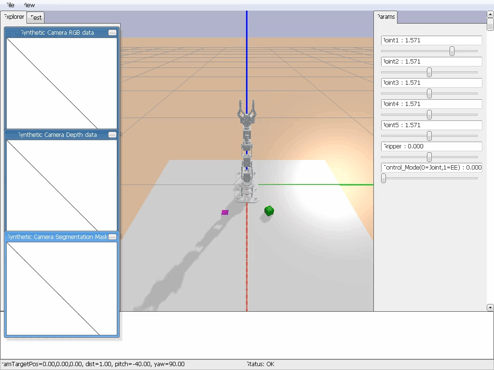

# DOFBOT

## 简介

本仓库为 上海交通大学 **机器人学(AU3307)/智能机器人(AI3703)** 课程大作业，完成于2025年秋季学期，任务要求详见 [大作业 1 2](https://github.com/PasserbyZzz/DOFBOT/blob/main/Dofbot_sim/report/2025dofbot大作业介绍.pdf)、[大作业 3](https://github.com/PasserbyZzz/DOFBOT/blob/main/Dofbot_rl/Panda_DQN_TODO/report/强化学习大作业介绍.pdf)。

欢迎任何的 **`Issues`** 以及 **`Pull requests`**!

## 总体流程

### 大作业 1

1. 基于 `RobotToolboxPython` 工具完成 Dofbot 构型机械臂的建模、正运动学求解、逆运动学求解与工作空间的绘制；
2. 在 `PyBullet` 中，采集 Dofbot 机械臂末端位姿与关节角数据；
3. 训练神经网络模型，实现对机械臂正逆运动学的求解，并评估训练得到模型的精度；
4. 在 `PyBullet` 中，控制 Dofbot 机械臂完成物块抓取放置任务。

### 大作业 2

1. 了解节点、话题、消息等 ROS 基础知识；
2. 结合 ROS 与 Dofbot 机械臂进行通信，控制机械臂完成实机抓取放置任务。

### 大作业 3

1. 使用仿真环境 `pybullet` 完善抓取方块任务的仿真环境；
2. 使用强化学习算法（DQN），完成抓取方块任务的操作策略的训练和优化；
3. 机械臂夹爪距离目标物体的距离小于阈值（0.005m），则视为任务成功。

**拓展任务：**

1. 使用仿真环境 `pybullet` 完善抓取方块任务的仿真环境；
2. 使用强化学习算法（SAC），完成抓取方块任务的操作策略的训练和优化；
3. 机械臂夹爪距离目标物体的距离小于阈值（0.01m），则视为任务成功。

### 平时作业

1. 运动学习题；
2. 动力学习题。

## 具体实现

### 大作业 1

详见 [大作业 1 实验报告](https://github.com/PasserbyZzz/DOFBOT/blob/main/Dofbot_sim/report/report.pdf)。

### 大作业 2

详见 [大作业 2 实验报告](https://github.com/PasserbyZzz/DOFBOT/blob/main/Dofbot_ctrl/report/report.pdf)。

### 大作业 3

详见 [大作业 3 实验报告](https://github.com/PasserbyZzz/DOFBOT/blob/main/Dofbot_rl/Dofbot_DQN_TODO/report/report.pdf) 和 [拓展任务实验报告](https://github.com/PasserbyZzz/DOFBOT/blob/main/Dofbot_rl/Panda_SAC_TODO/report/report.pdf)。

### 平时作业

详见 [运动学习题](https://github.com/PasserbyZzz/DOFBOT/blob/main/HWs/hw1-运动学习题.pdf) 和 [动力学习题](https://github.com/PasserbyZzz/DOFBOT/blob/main/HWs/hw2-动力学习题.pdf)。

## 效果展示

### 大作业 1 2

  <table align="center">
    <tr>
      <td align="center">
        
         
      </td>
      <td align="center">
        
         
      </td>
    </tr>
  </table>

### 大作业 3

  <table align="center">
    <tr>
      <td align="center">
        
         
      </td>
      <td align="center">
        
         
      </td>
    </tr>
  </table>

## 文件目录

- **DOFBOT**
  - **Dofbot**：Dofbot 上位机，用于人工标定关节角度
  - **Dofbot_ctrl**：Dofbot 真机部署（大作业 2）
  - **Dofbot_sim**：DH 参数建模、正逆运动学、机械臂抓取等（大作业 1）
  - **Dofbot_rl**：
    - **Pnada_SAC_TODO**：SAC 算法训练 Dofbot 机械臂抓取（拓展任务）
    - **Dofbot_DQN_TODO**：DQN 算法训练 franka-panda 机械臂抓取（大作业 3）
  - **HWs**：平时作业

_注意：_ 请分别以 **`Dofbot_sim`** **`Dofbot_ctrl`** **` Dofbot_DQN_TODO`** 或 **`Pnada_SAC_TODO`** 为根目录运行！

## 邮箱

任何疑问，欢迎邮件交流：**`passerby_zzz@sjtu.edu.cn`** !

## **Wish for your Star⭐!**
